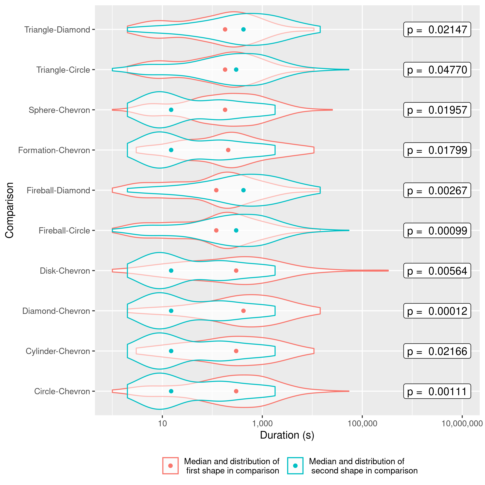

```{r setup, include=FALSE}
knitr::opts_chunk$set(echo = FALSE, warning = FALSE, message = FALSE)
library(tidyverse)
library(readr)
library(ggplot2)
library(knitr)
```

# Introduction

Unidentified flying objects (UFOs) have a long and somewhat contentious history. Contrary to popular belief, most sightings are actually honest mistakes and not hoaxes. Weather balloons, satellites, and other explicable phenomena account for the vast majority of sightings. We wondered if these different phenomenon might leave traces in the data. Suspecting that different causes would be associated with different shapes of UFO reported in the sighting, we thought that these different causes might lead to different duration of sightings in our home areas of Washington and British Columbia.

# Data

```{r}
ufo_raw <- read_csv("../data/raw/aliens.csv")
ufo_tidy <- read_csv("../data/processed/aliens.csv")
```

To test our hypothesis, we selected the dataset UFO sightings maintained by [@nuforc]. The data is submitted by users and in the majority of cases presented in the users' own words. Each report in the NUFORC database contains information on the data and time of the sighting, the location, the shape of the object observed, how long it was observed for, and a short description of the event. For analysis, we have selected reports made in [British Columbia, Canada](http://www.nuforc.org/webreports/ndxlBC.html) and [Washington State, USA](http://www.nuforc.org/webreports/ndxlWA.html) before 11/18/2020. The selected reports include a total `r nrow(ufo_raw)` observations. The present analysis was limited to the shape of the objects observed and the duration for which they were observed.

## Data Processing

Data was analyzed using both the R [@R] and Python [@Python] programming languages. A comprehensive list of packaged used can be found in the readme file of [this project's GitHub repository](https://github.com/UBC-MDS/out_of_this_world).

### Duration of Observation

Each UFO sighting report included from NUFORC includes a text column where users have the opportunity to described how long they observed the unknown object. These descriptions do not have a consistent format. For example, the following demonstrate some of the variety of different formats in which duration data is presented:

-   "20:45"
-   "3-4 minutes"
-   "Ten minutes"
-   "every evening for the las"
-   ".30"
-   "Ongoing"

Where possible, the reported durations were programmatically converted to a standardized measure (total duration in seconds). Where this was not possible, observations were discarded. It is acknowledged that this introduces a bias in the results toward observations from people who recorded the duration of their observations in a method that can be easilty interpreted programmatically.

### Shape

In most cases, users indicate the shape of the object that they observed in their report. Reports that did not specify any shape or specified something other than shape, for example `Flash`, `Light`, `Unknown`, `Other`, `Changing`, were removed.

## Data Visualization

The processed data set used in the analysis consists of `r nrow(ufo_tidy)` observations. The following box plot illustrates sample data set included in this analysis. Note that because the data are significantly right skewed, the duration has been plotted on a logarithmic axis so that the data can be more easily compared.


# Hypotheses

Because of the skewness of the data presented above, a comparison of the mean duration of observations between the different shapes would not be an appropriate approach. Instead, our hypotheses are formulated to look for a difference in the duration distributions between shapes on the basis of the ranks of duration of observations for the different shapes. More formally, our null ($H_0$) and alternate ($H_A$) hypotheses are:

-   $H_0$ The mean ranks of the duration of sightings for all shapes are equal.

-   $H_A$ The mean ranks of the duration of sightings for all shapes are not equal.

# Analysis

To test our hypotheses, we took a non-parametric approach because of differences in group size, skewed distribution, and variance between the different duration of different shapes. We selected the Kruskal-Wallis H Test to test to determine if significant differences existed. A Dunn test was utilized for Post-Hoc analysis with Bonferroni's correction to identify pairs of groups whose median population duration are significantly different. We selected a significance level of $\alpha =0.05$ for both steps in testing.

# Results & Discussion

**Kruskal Wallis H Test**

The Kruskal Wallis H Test resulted in a $p$-value much less than our stated significance level of 0.05, therefore, we reject the null hypothesis that the mean ranks of the duration of sightings are equal for all shapes.

```{r}
kw_test <- readRDS(here::here("results", "KW.rds"))
kw_cap <- "Table 1. Kruskal Wallis H Test Test Results"
knitr::kable(kw_test, caption = kw_cap)
```

**Dunn Test**

Knowing that the mean ranks of the duration of sightings are not equal for all shapes, we are interested in comparing each shape to all the other shapes. A Dunn test was used to perform pairwise comparisons. The pairs of distributions which showed a statistically significant difference are presented in the table below along with their $p$-values (using the Bonferroni correction).

```{r}
summary <- readRDS(here::here("results", "Dunn.rds"))
summary_cap <- "Table 2. Shape pairs with significant difference in mean ranks"
knitr::kable(summary, caption = summary_cap)
```

To assist in visualizing these results, the following plot graphically depicts the pairs of distribution that showed a statistically significant difference (red) and those which did not (grey).

**Post-Hoc Analysis Result**


The figure below further explores the differences between distributions by overlaying violin plots for each of the distribution pairs along with the distribution medians. The adjusted pairwise $p$-values are also presented.

**Pairwise distributions and medians**



Based on the results of these pairwise comparisons, we see that the distributions of several shapes are significantly different from one another. We are not, however, able to postulate a cause for the difference based on these analyses.

There are some important limitations to this work. As discussed in previous sections we removed a good deal of data in processing. There is potential that we somehow introduced a bias into our results through this process. Furthermore, our sample was not random or representative of all UFO sightings in the BC and Washington area because we only had access to samples that were reported.

# Summary

A UFO sighting data set including UFO shape and duration of sighting was obtained for British Columbia and Washington State from NUFORC. A Kruskal Wallis H test was used to determine that there was a significant difference in the mean ranks of duration among the shapes. Pairwise Dunn tests revealed that several shapes were significantly different from one another. Further research would be necessary to determine the underlying cause(s) of the differences.

# References
