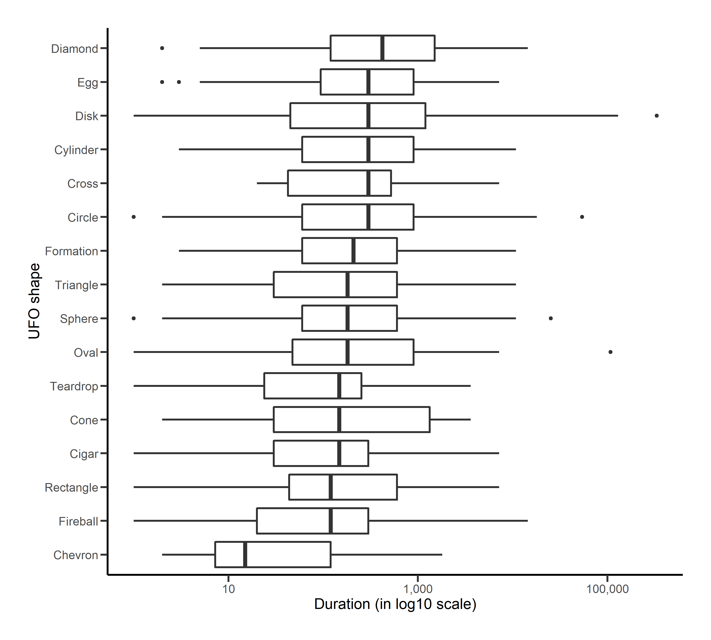
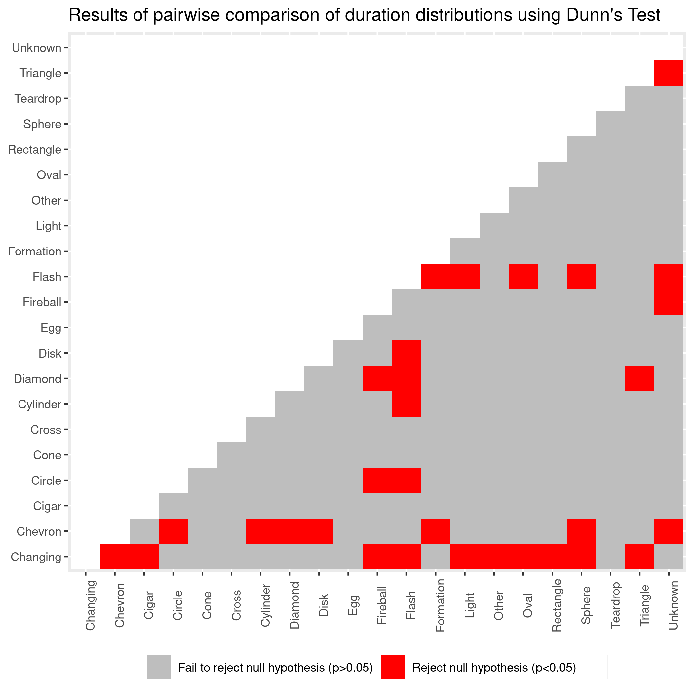

UFO Report
================
Group-20 DSCI-522
11/28/2020

# Summary

# Introduction

## Data

We have selected the dataset of reported sightings of unidentified flying objects (UFO) that is maintained by National UFO Reporting Center (NUFORC). The data is submitted by users and in the majority of cases presented in the users' own words. For analysis, we have selected reports made in British Columbia,Canada and Washigton State, USA before 11/18/2020. There are 4710 observations and 7 features in the data set. However, there are many records with invalid shape or durations. Each row contains information on a single reported UFO sighting.

### Data Processing

The duration column in the data has been processed to extract numerical time information and converted to reported time in seconds.It was then converted to logscale. The processing then removes observations which the duration did not have any numerical time information in it, For example: `still here`, `seconds`, `unknown`, `some minutes`. We also ignore shapes like `Flash`, `Light`, `Unknown`, `Other`, `Changing`. The final data used in the analysis has 3287 observations

## Analysis

**Hypothesis**

-   *H*0 The median population duration of all the shapes are equal

-   *H**A* The median population duration of all the shapes are equal

We use Kruskal Wallis H Test to test our Hypothesis. Further we use Dunn's test for Post-Hoc analysis and perform multiple comparisons to identify pairs of groups whose median population duartion are significantly not equal. significance level of *α* = 0.05 is used in the test.

# Results & Discussion

**EDA** 

**Kruskal Wallis H Test**

|  statistic|  p.value|  parameter| method                       |
|----------:|--------:|----------:|:-----------------------------|
|   75.12304|        0|         17| Kruskal-Wallis rank sum test |

**P value of significant pairs from Dunn Test**

| Shape     |  median|  count|  min|     max|
|:----------|-------:|------:|----:|-------:|
| Chevron   |      15|     34|    2|    1800|
| Flash     |      25|     71|    1|   90000|
| Fireball  |     120|    253|    1|   14400|
| Rectangle |     120|     44|    1|    7200|
| Cigar     |     150|     56|    1|    7200|
| Cone      |     150|     16|    2|    3600|
| Teardrop  |     150|     20|    1|    3600|
| Light     |     180|    815|    1|   86400|
| Other     |     180|    220|    1|   28800|
| Oval      |     180|    159|    1|  108000|
| Sphere    |     180|    239|    1|   25200|
| Triangle  |     180|    257|    2|   10800|
| Formation |     210|    114|    3|   10800|
| Circle    |     300|    374|    1|   54000|
| Cross     |     300|     11|   20|    7200|
| Cylinder  |     300|     48|    3|   10800|
| Disk      |     300|    141|    1|  331200|
| Egg       |     300|     28|    2|    7200|
| Unknown   |     300|    257|    1|   72000|
| Diamond   |     420|     52|    2|   14400|
| Changing  |     600|     78|    3|   21600|

**Post-Hoc Analysis Result**

# References
